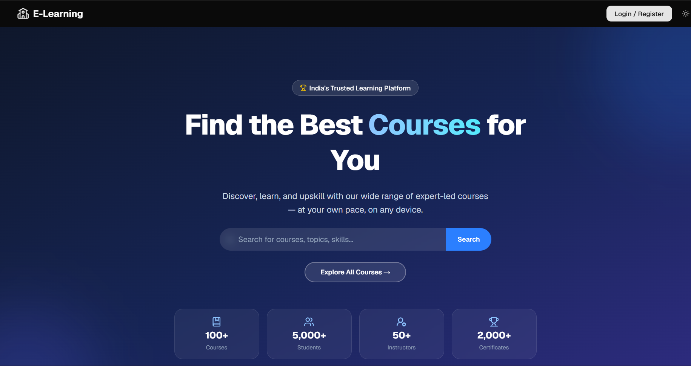
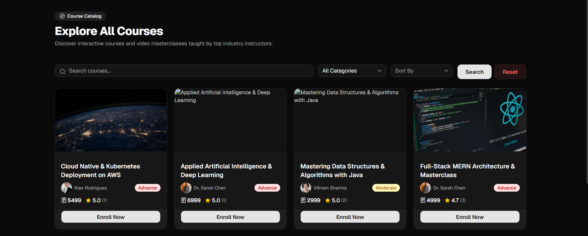
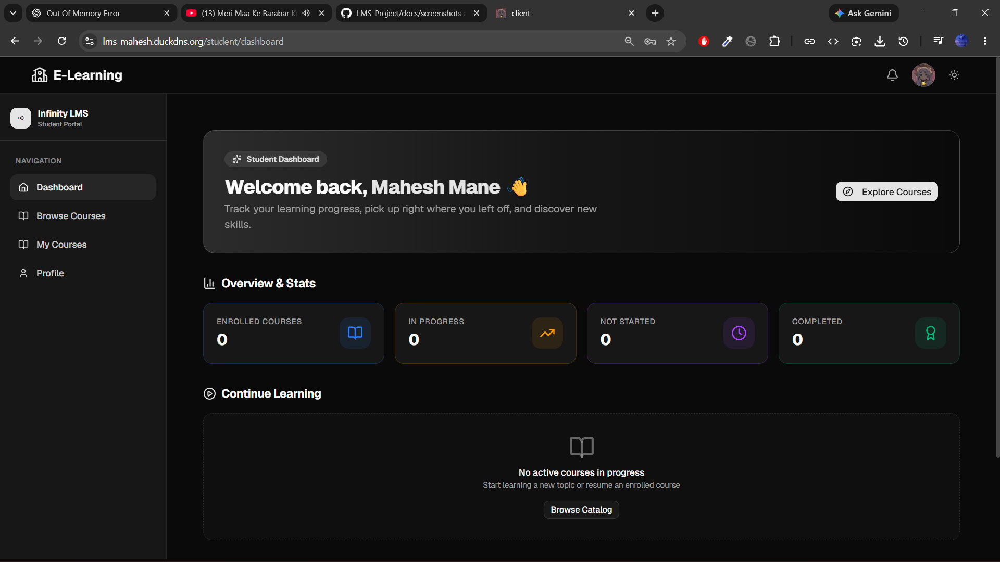
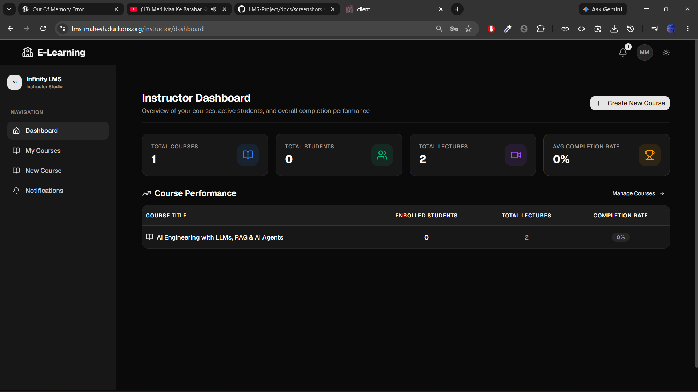
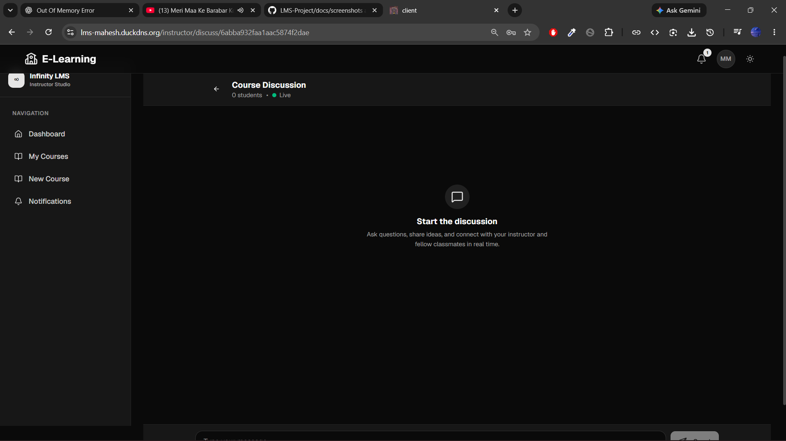
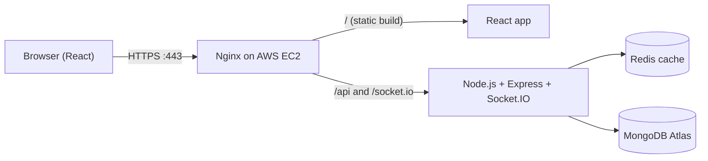

# 🎓 LMS — Learning Management System

A full-stack learning platform with **instructor and student roles**, course delivery, **real-time discussion rooms**, **online payments** and **certificates**. Deployed on **AWS EC2** behind **Nginx with HTTPS**.

**🔗 Live demo:** https://lms-mahesh.duckdns.org
**🎬 Demo video:** _add your LinkedIn / YouTube link here_



---

## ✨ Features

| Role | What they can do |
| --- | --- |
| 👩‍🏫 **Instructor** | Create and manage courses and content, see student progress |
| 🎒 **Student** | Browse and enroll in courses, pay online, track progress, earn a certificate |
| 💬 **Real-time** | Course discussion rooms and live notifications via Socket.IO |
| 💳 **Payments** | Razorpay checkout for paid courses |
| 📜 **Certificates** | Generated automatically when a course is completed |
| 🔐 **Security** | JWT authentication in HTTP-only cookies, role-based access |

## 🖼️ Screenshots

| Course catalog | Student dashboard |
| --- | --- |
|  |  |

| Instructor panel | Discussion room |
| --- | --- |
|  |  |

## 🏗️ Architecture



### What happens when you open the app

1. **DNS** resolves the domain to the EC2 Elastic IP.
2. The **AWS Security Group** allows HTTPS (port 443).
3. **Nginx** completes the TLS handshake (Let's Encrypt certificate).
4. Nginx serves the **React** build for pages and proxies `/api/` and `/socket.io/` to **Node.js**.
5. React calls `GET /api/v1/...`; Express verifies the **JWT from the HTTP-only cookie**.
6. The backend checks **Redis** first. On a miss it reads **MongoDB Atlas** and caches the result. <!-- CONFIRM: Redis is live on the server -->
7. The response travels back to the browser, and **Redux** + React render the UI.
8. **Socket.IO** keeps a live connection open for chat and notifications.

## 🧰 Tech Stack

| Layer | Technology |
| --- | --- |
| Frontend | React, React Router, Redux |
| Backend | Node.js, Express |
| Database | MongoDB Atlas |
| Cache | Redis <!-- CONFIRM --> |
| Real-time | Socket.IO |
| Payments | Razorpay |
| Auth | JWT in HTTP-only cookies |
| Deployment | AWS EC2, Nginx, Let's Encrypt (HTTPS) |
| Containers | Docker Compose files included <!-- CONFIRM: running in production? --> |

## 🚀 Getting Started

```bash
git clone https://github.com/Maheshs-Github/LMS-Project.git
cd LMS-Project
```

**Backend**

```bash
cd server
cp .env.example .env     # fill in your values
npm install
npm run dev
```

**Frontend**

```bash
cd client
cp .env.example .env     # if present
npm install
npm run dev
```

**With Docker (development)**

```bash
docker compose -f docker-compose.dev.yml up --build
```

<!-- CONFIRM: check these commands match your package.json scripts -->

### Environment variables

See `server/.env.example`. Typical values: MongoDB connection string, JWT secret, Razorpay keys, Redis URL, client URL. **Never commit your real `.env`.**

## 📁 Project Structure

```
LMS-Project/
├── client/                  # React frontend
├── server/                  # Express API + Socket.IO
├── docker-compose.yml       # Production-style compose file
├── docker-compose.dev.yml   # Development compose file
└── README.md
```

## 🧠 Challenges & Learnings

- **Two roles, one codebase:** instead of separate dashboards and collections, I modelled progress and content visibility with role-scoped queries, so the logic isn't duplicated.
- **Serving a React SPA behind Nginx:** `try_files $uri $uri/ /index.html` stops client-side routes like `/student` from returning 404 on refresh.
- **Why HTTP-only cookies:** keeping the JWT out of `localStorage` protects it from XSS-based theft.
- **Cache-aside with Redis:** read from Redis first, fall back to MongoDB, then store the result for next time. <!-- CONFIRM -->
- **Real-time:** Socket.IO needs its own Nginx location with WebSocket upgrade headers.

## 🗺️ Roadmap

- [x] Instructor and student roles
- [x] Course creation, enrollment and progress tracking
- [x] Razorpay payments
- [x] Real-time discussion rooms (Socket.IO)
- [x] Deployment on AWS EC2 with Nginx and HTTPS
- [ ] Fully containerized deployment with Docker
- [ ] Verifiable certificate links
- [ ] AI course Q&A assistant (LangGraph)

## 📄 License

MIT

---

⭐ If you found this useful, consider starring the repo. Feedback and ideas for v2 are very welcome!
